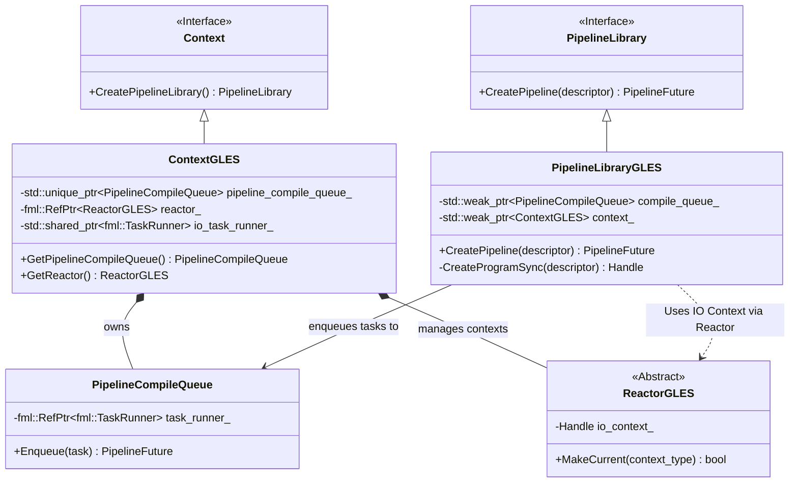
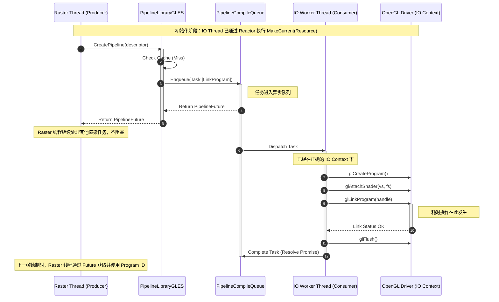

# LearnVulkan

```mermaid
classDiagram
    class Context {
        <<Interface>>
        +CreatePipelineLibrary() PipelineLibrary
    }

    class ContextGLES {
        -std::unique_ptr~PipelineCompileQueue~ pipeline_compile_queue_
        -fml::RefPtr~ReactorGLES~ reactor_
        -std::shared_ptr~fml::TaskRunner~ io_task_runner_
        +GetPipelineCompileQueue() PipelineCompileQueue
        +GetReactor() ReactorGLES
    }

    class PipelineCompileQueue {
        -fml::RefPtr~fml::TaskRunner~ task_runner_
        +Enqueue(task) PipelineFuture
    }

    class PipelineLibrary {
        <<Interface>>
        +CreatePipeline(descriptor) PipelineFuture
    }

    class PipelineLibraryGLES {
        -std::weak_ptr~PipelineCompileQueue~ compile_queue_
        -std::weak_ptr~ContextGLES~ context_
        +CreatePipeline(descriptor) PipelineFuture
        -CreateProgramSync(descriptor) Handle
    }

    class ReactorGLES {
        <<Abstract>>
        -Handle io_context_
        +MakeCurrent(context_type) bool
    }

    Context <|-- ContextGLES
    PipelineLibrary <|-- PipelineLibraryGLES
    ContextGLES *-- PipelineCompileQueue : owns
    ContextGLES *-- ReactorGLES : manages contexts
    PipelineLibraryGLES --> PipelineCompileQueue : enqueues tasks to
    PipelineLibraryGLES ..> ReactorGLES : Uses IO Context via Reactor
```

```mermaid
sequenceDiagram
    autonumber
    participant R as Raster Thread (Producer)
    participant PL as PipelineLibraryGLES
    participant Q as PipelineCompileQueue
    participant IO as IO Worker Thread (Consumer)
    participant GL as OpenGL Driver (IO Context)

    Note over R, GL: 初始化阶段：IO Thread 已通过 Reactor 执行 MakeCurrent(Resource)

    R->>PL: CreatePipeline(descriptor)
    activate PL
    PL->>PL: Check Cache (Miss)
    
    PL->>Q: Enqueue(Task [LinkProgram])
    activate Q
    Note right of Q: 任务进入异步队列
    Q-->>PL: Return PipelineFuture
    PL-->>R: Return PipelineFuture
    deactivate PL

    Note over R: Raster 线程继续处理其他渲染任务，不阻塞

    Q->>IO: Dispatch Task
    activate IO
    Note over IO: 已经在正确的 IO Context 下
    IO->>GL: glCreateProgram()
    IO->>GL: glAttachShader(vs, fs)
    IO->>GL: glLinkProgram(handle)
    activate GL
    Note right of GL: 耗时操作在此发生
    GL-->>IO: Link Status OK
    deactivate GL
    IO->>GL: glFlush()
    
    IO->>Q: Complete Task (Resolve Promise)
    deactivate IO
    deactivate Q

    Note over R: 下一帧绘制时，Raster 线程通过 Future 获取并使用 Program ID
```
